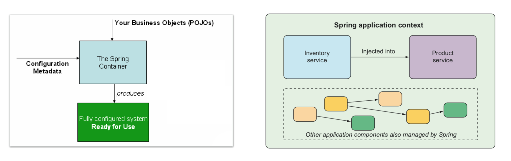
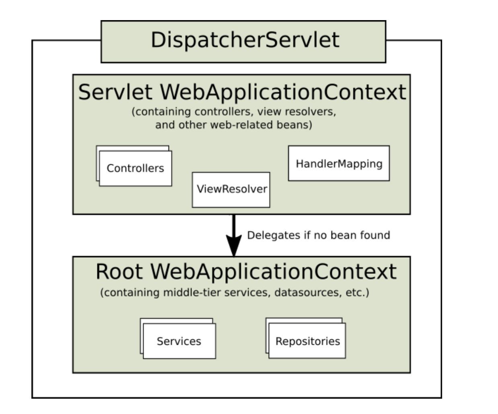
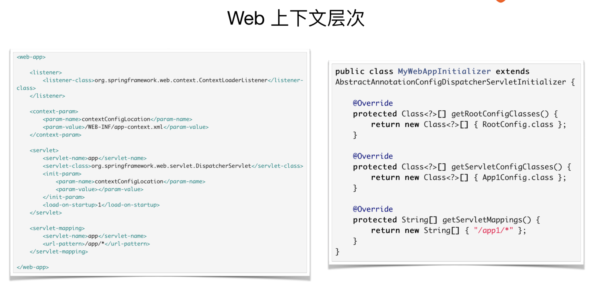
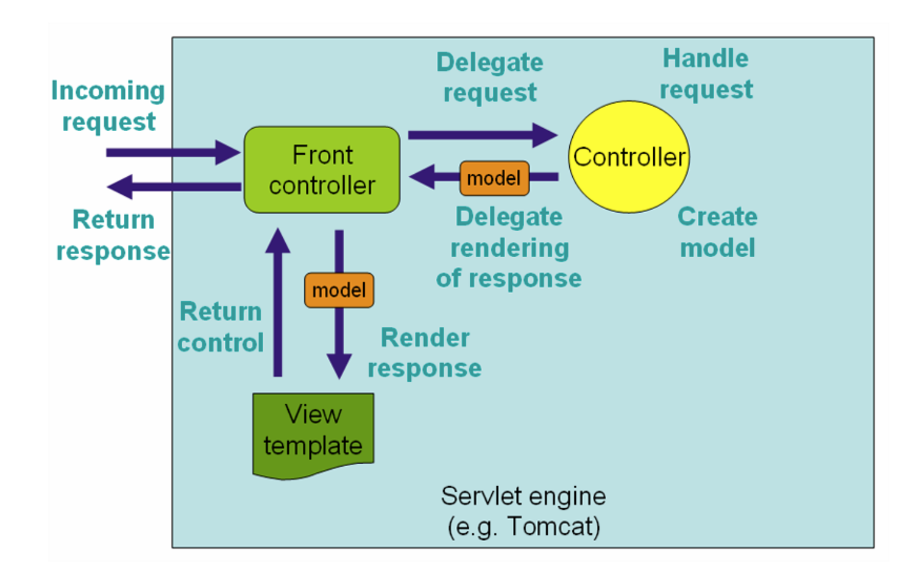
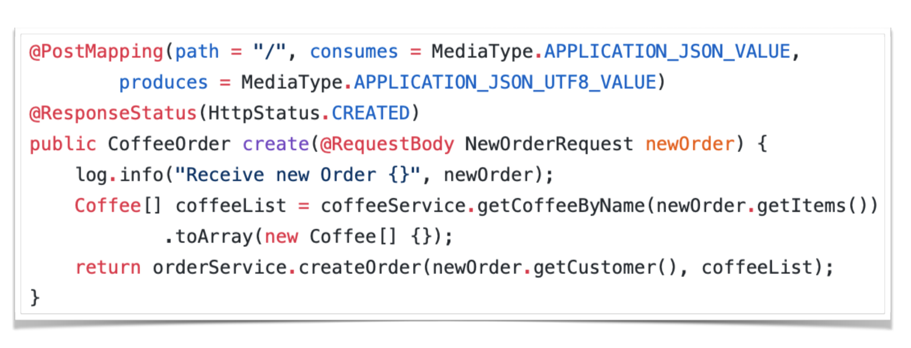
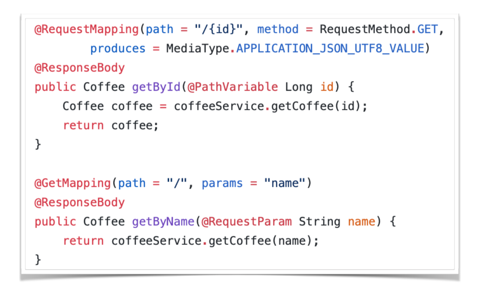
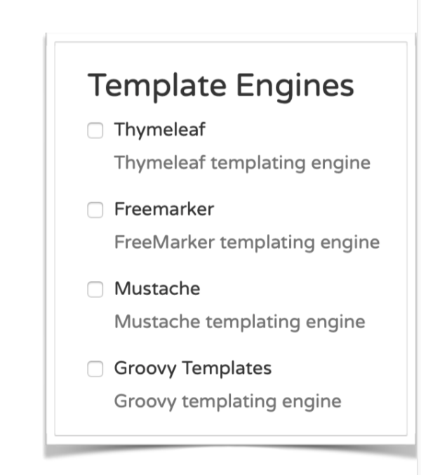
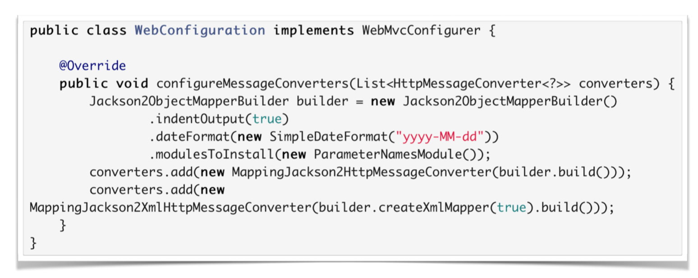
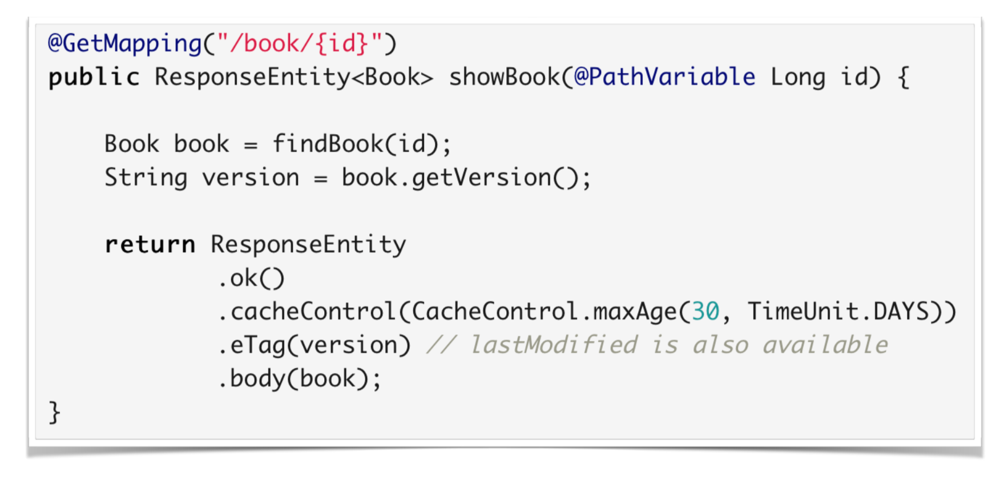

6 谈谈 Web 那些事
====

## Spring MVC 实践

动手实践一下: 编写第⼀个Spring MVC Controller

### 认识 Spring MVC

DispatcherServlet

* Controller

* xxxResolver

	* ViewResolver

	* HandlerExceptionResolver

	* MultipartResolver

* HandlerMapping

### Spring MVC 中的常⽤用注解

* @Controller
	
	* @RestController

* @RequestMapping
	
	* @GetMapping / @PostMapping

	* @PutMapping / @DeleteMapping

* @RequestBody / @ResponseBody / @ResponseStatus

> 代码示例: Chapter 6 / simple-controller-demo

## 理解 Spring 的应⽤用上下⽂

### Spring 的应⽤用程序上下⽂

  
 

### 关于上下⽂常⽤的接⼝

* BeanFactory

	* DefaultListableBeanFactory

* ApplicationContext

	* ClassPathXmlApplicationContext

	* FileSystemXmlApplicationContext
	
	* AnnotationConfigApplicationContext 

* WebApplicationContext

### Web 上下⽂文层次

  
 

  
 

> 代码示例: Chapter 6 / context-hierarchy-demo

## Spring MVC 中的各种机制: 请求处理

### Spring MVC 的请求处理流程

  
 

### 一个请求的⼤大致处理流程

#### 1. 绑定⼀些 Attribute

- WebApplicationContext / LocaleResolver / ThemeResolver

#### 2. 处理 Multipart

- 如果是，则将请求转为 MultipartHttpServletRequest 

#### 3. Handler 处理

- 如果找到对应 Handler，执⾏行行 Controller 及前后置处理器逻辑 

#### 4. 处理返回的 Model ，呈现视图

## 如何定义处理⽅法

### 定义映射关系

#### @Controller 
#### @RequestMapping

* path / method 指定映射路路径与方法 

* params / headers 限定映射范围 

* consumes / produces 限定请求与响应格式

#### 一些快捷⽅式

* @RestController

* @GetMapping / @PostMapping / @PutMapping / @DeleteMapping / @PatchMapping

### 定义处理⽅法

* @RequestBody / @ResponseBody / @ResponseStatus

* @PathVariable / @RequestParam / @RequestHeader

* HttpEntity / ResponseEntity

#### 详细参数

- https://docs.spring.io/spring/docs/5.1.5.RELEASE/spring-framework- reference/web.html#mvc-ann-arguments

#### 详细返回

- https://docs.spring.io/spring/docs/5.1.5.RELEASE/spring-framework- reference/web.html#mvc-ann-return-types

### ⽅法示例例

  
 

  
 

> 代码示例: Chapter 6 / complex-controller-demo

## 定义类型转换

### 自⼰己实现 WebMvcConfigurer

* Spring Boot 在 WebMvcAutoConfiguration 中实现了⼀个 
* 添加⾃自定义的 Converter
* 添加⾃自定义的 Formatter

## 定义校验

- 通过 Validator 对绑定结果进⾏行行校验

	- Hibernate Validator

- @Valid 注解

- BindingResult

## Multipart 上传

- 配置 MultipartResolver

	- Spring Boot ⾃自动配置 MultipartAutoConfiguration

- 支持类型 multipart/form-data 

- MultipartFile 类型

> 代码示例: Chapter 6 / more-complex-controller-demo

## Spring MVC 中的各种机制 : 视图处理

### 视图解析的实现基础

#### ViewResolver 与 View 接⼝

* AbstractCachingViewResolver

* UrlBasedViewResolver
* FreeMarkerViewResolver
* ContentNegotiatingViewResolver
* InternalResourceViewResolver

### DispatcherServlet 中的视图解析逻辑

- initStrategies()

	- initViewResolvers() 初始化了对应 ViewResolver 
	
- doDispatch()
	
	- processDispatchResult()
	- 没有返回视图的话，尝试 RequestToViewNameTranslator r
	- esolveViewName() 解析 View 对象

#### 使⽤用 @ResponseBody 的情况

- 在 HandlerAdapter.handle() 的中完成了 Response 输出

	* RequestMappingHandlerAdapter.invokeHandlerMethod()

		* HandlerMethodReturnValueHandlerComposite.handleReturnValue()

			* RequestResponseBodyMethodProcessor.handleReturnValue()

### 重定向

#### 两种不不同的重定向前缀

* redirect:

* forward:

## Spring MVC 中的常⽤用视图

### Spring MVC ⽀支持的视图

#### 支持的视图列列表

* https://docs.spring.io/spring/docs/5.1.5.RELEASE/spring-framework-reference/web.html#mvc-view

* reference/web.html#mvc-view
* Jackson-based JSON / XML 
* Thymeleaf & FreeMarker

  
 

### 配置 MessageConverter

- 通过 WebMvcConfigurer 的 configureMessageConverters()
	
	- Spring Boot ⾃自动查找 HttpMessageConverters 进⾏行行注册

  
 

### Spring Boot 对 Jackson 的⽀支持
*  JacksonAutoConfiguration

	* Spring Boot 通过 @JsonComponent 注册 JSON 序列列化组件
	
	* Jackson2ObjectMapperBuilderCustomizer 
* JacksonHttpMessageConvertersConfiguration

	
	* 增加 jackson-dataformat-xml 以⽀支持 XML 序列列化

> 代码示例：Chapter 6 / json-view-demo

## 使用 Thymeleaf

> “Thymeleaf is a modern server-side Java template engine for both web and standalone environments.”

### 添加 Thymeleaf 依赖
org.springframework.boot:spring-boot-starter-thymeleaf
### Spring Boot 的⾃自动配置

* ThymeleafAutoConfiguration
	
	* ThymeleafViewResolver

### Thymeleaf 的⼀些默认配置

* spring.thymeleaf.cache=true 

* spring.thymeleaf.check-template=true 
* spring.thymeleaf.check-template-location=true 
* spring.thymeleaf.enabled=true 
* spring.thymeleaf.encoding=UTF-8 
* spring.thymeleaf.mode=HTML 
* spring.thymeleaf.servlet.content-type=text/html 
* spring.thymeleaf.prefix=classpath:/templates/ 
* spring.thymeleaf.suffix=.html

> 代码示例：Chapter 6 / thymeleaf-view-demo

## 静态资源与缓存

### Spring Boot 中的静态资源配置 

#### 核⼼心逻辑

* WebMvcConfigurer.addResourceHandlers()

#### 常⽤用配置

* spring.mvc.static-path-pattern=/**
* spring.resources.static-locations=classpath:/META-INF/ resources/,classpath:/resources/,classpath:/static/,classpath:/public/

### Spring Boot 中的缓存配置

#### 常⽤用配置(默认时间单位都是秒)

* ResourceProperties.Cache
* spring.resources.cache.cachecontrol.max-age=时间 
* spring.resources.cache.cachecontrol.no-cache=true/false 
* spring.resources.cache.cachecontrol.s-max-age=时间

### Controller 中⼿手⼯设置缓存

  
 

> 代码示例：Chapter 6 / cache-demo

### 建议的资源访问⽅式

  
 

## Spring MVC 中的各种机制: 异常处理

### Spring MVC 的异常解析

#### 核⼼心接⼝
HandlerExceptionResolver
#### 实现类

* SimpleMappingExceptionResolver
* DefaultHandlerExceptionResolver
* ResponseStatusExceptionResolver
* ExceptionHandlerExceptionResolver

### 异常处理⽅法

#### 处理⽅法

@ExceptionHandler 
#### 添加位置

* @Controller / @RestController
* @ControllerAdvice / @RestControllerAdvice

> Chapter 6 / exception-demo

## 了解 Spring MVC 的切⼊点

### Spring MVC 的拦截器

#### 核⼼心接⼝

* HandlerInteceptor
	* boolean preHandle()
	* void postHandle()
	* void afterCompletion()

####针对 @ResponseBody 和 ResponseEntity 的情况
* •ResponseBodyAdvice
####针对异步请求的接⼝
* AsyncHandlerInterceptor
* void afterConcurrentHandlingStarted()

### 拦截器的配置⽅式

#### 常规⽅法
* •WebMvcConfigurer.addInterceptors()
#### Spring Boot 中的配置

* 创建⼀个带 @Configuration 的 WebMvcConfigurer 配置类 
* 不不能带 @EnableWebMvc(想彻底⾃自⼰己控制 MVC 配置除外)

> Chapter 6 / springbucks

## SpringBucks 进度⼩小结

* 拆分了 waiter-service
* 增加了更更多 REST ⽅法 
* 增加了缓存、性能⽇日志与异常处理

## 本章⼩小结

* 解释了什么是 Spring 的 ApplicationContext

* 了解了 Spring MVC 的基本使⽤用 

* 理解 Spring MVC 的多种机制
